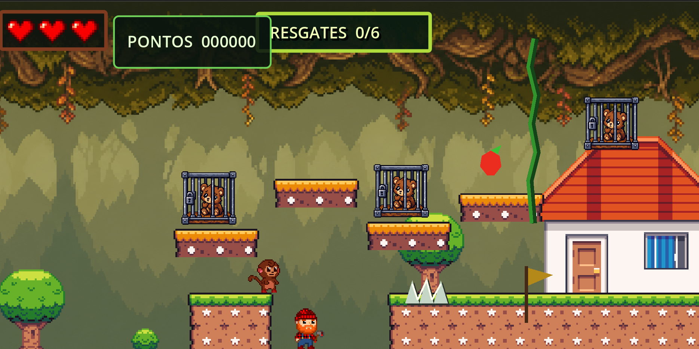
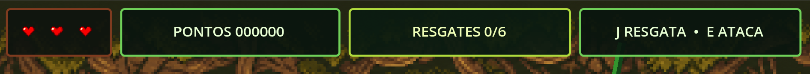

<div align="center">


# Punch

**Uma aventura 2D em pixel art sobre coragem, amizade e preservação da vida terrestre.**

[](https://godotengine.org/)
[](#como-executar-o-projeto)
[](#licença)
[](#status-do-projeto)

Plataforma • Conscientização ambiental • Pixel Art 2D • Aproximadamente 2 minutos por fase

</div>

---

## Sobre o jogo

**Punch** é um jogo de plataforma 2D desenvolvido na Godot Engine 4. O jogador controla um pequeno macaco que atravessa uma floresta ameaçada pelo desmatamento e pelo tráfico ilegal de animais, enfrentando lenhadores, superando obstáculos naturais e libertando animais mantidos em cativeiro.

A experiência combina plataforma, combate simples, exploração e resgates em ciclos curtos de aproximadamente dois minutos por fase. Cada ação positiva também provoca uma recompensa visual: conforme os animais são libertados, a floresta recupera cores mais vivas e tons de verde.

O projeto dialoga diretamente com o **Objetivo de Desenvolvimento Sustentável 15 — Vida Terrestre**, que promove a proteção e recuperação dos ecossistemas terrestres e a preservação da biodiversidade. Saiba mais na página oficial da [ONU sobre a ODS 15](https://sdgs.un.org/goals/goal15).

### Características principais

- Fases curtas e progressivas com duração aproximada de dois minutos.
- Combate corpo a corpo com soco direcional e knockback.
- Resgate de animais presos em gaiolas.
- Plataformas fixas e móveis, cipós, espinhos e áreas alagadas.
- Sistema de vida com três corações e invulnerabilidade temporária.
- Pontuação por combate, resgates e coleta de frutas.
- Transformação visual da floresta conforme o progresso.
- Execução local e exportação para navegadores via HTML5.

---

## Galeria / Screenshots

### Fase da floresta



### Interface durante o gameplay



> A galeria pode ser ampliada com novas capturas em `docs/images/`, incluindo combate, travessias com cipós e a recuperação visual da floresta.

---

## História & personagem

Punch foi inspirado na história real de um macaquinho rejeitado que encontrou conforto emocional em uma pelúcia de orangotango. Essa referência deu origem a uma aventura que começa como uma missão íntima e se transforma, inesperadamente, em uma jornada heroica.

Ao atravessar a floresta, Punch encontra animais capturados, áreas degradadas e lenhadores que ameaçam o ecossistema. Mesmo sem partir em busca de reconhecimento, ele enfrenta esses perigos, liberta os animais e contribui para que a floresta volte a florescer.

No fim da jornada, a verdadeira motivação de Punch é revelada: ele estava tentando recuperar sua amada pelúcia, guardada na caminhonete do caçador. Ao seguir esse objetivo pessoal, o pequeno macaco acaba se tornando um herói da floresta por acidente.

---

## Mecânicas e controles

### Controles

| Ação | Tecla | Descrição |
|---|:---:|---|
| Mover para a esquerda | `A` ou `←` | Move Punch para a esquerda. |
| Mover para a direita | `D` ou `→` | Move Punch para a direita. |
| Pular | `W`, `↑` ou `Espaço` | Executa um salto quando Punch está no chão. |
| Subir no cipó | `W` ou `↑` | Move Punch para cima enquanto está no cipó. |
| Descer no cipó | `S` ou `↓` | Move Punch para baixo enquanto está no cipó. |
| Soltar o cipó | `Espaço` | Desprende Punch do cipó e inicia um salto. |
| Atacar | `E` | Executa um soco direcional contra os lenhadores. |
| Interagir / resgatar | `J` | Abre gaiolas próximas e liberta os animais. |
| Abrir ou fechar o menu | `Esc` | Pausa a partida ou retorna ao jogo. |

### Vida e dano

Punch inicia a partida com **três corações**. Espinhos, água e ataques inimigos removem um coração. Depois de receber dano, o personagem retorna ao último checkpoint e ganha um breve período de invulnerabilidade, evitando dano repetido imediato.

Quando os três corações são perdidos, a tela de derrota é exibida e o jogador pode reiniciar a partida.

### Combate

O ataque exclusivo de Punch é um soco direcional ativado pela tecla `E`. O golpe:

- Atinge inimigos na direção para a qual Punch está olhando.
- Causa dano aos lenhadores.
- Aplica knockback para afastar o inimigo.
- Impede múltiplos acertos no mesmo inimigo durante uma única animação.

### Pontuação e coletáveis

| Evento | Recompensa | Efeito adicional |
|---|---:|---|
| Derrotar um lenhador | `+100` pontos | Remove uma ameaça da fase. |
| Resgatar um animal | `+250` pontos | Contribui para a recuperação visual da floresta. |
| Coletar uma fruta | `+25` pontos | Recupera um coração, respeitando o máximo de três. |

### Resgates e resposta ambiental

Animais presos podem ser libertados ao pressionar `J` perto de uma gaiola. O progresso é registrado pelo sistema de resgates e apresentado na HUD.

À medida que os resgates acontecem, a floresta deixa os tons degradados e recupera gradualmente uma aparência mais viva e verde. Essa mudança oferece retorno visual imediato e reforça a mensagem ambiental do jogo.

---

## Arquitetura técnica

### Tecnologias

| Tecnologia | Uso no projeto |
|---|---|
| [Godot Engine 4.x](https://godotengine.org/) | Motor de jogo, física 2D, cenas, animações, interface e exportação Web. |
| GDScript | Gameplay, movimentação, combate, resgates, pontuação, checkpoints e menus. |
| Piskel | Produção e edição dos sprites em pixel art. |
| Git | Versionamento distribuído do código e dos recursos. |
| GitHub | Hospedagem do repositório, colaboração e revisão de mudanças. |
| HTML5 / Web | Distribuição para navegadores com objetivo de 60 FPS. |

### Organização do projeto

```text
PunchGame/
├── docs/images/       # Screenshots usados na documentação
├── entities/          # Personagem, inimigos, HUD e objetos interativos
├── scene/             # Fases e cenas principais
├── sprites/           # Sprites, cenários, HUD e pixel art
├── systems/           # Gerenciadores de vida, pontuação e resgates
├── tiles/             # TileSets de terreno e decoração
├── PrimeiraCena.tscn  # Cena inicial e Fase 1
└── project.godot      # Configuração principal do projeto
```

### Sistemas globais

O projeto utiliza autoloads para manter dados compartilhados entre cenas:

- `HealthManager`: controla os três corações e emite atualizações de vida.
- `ScoreManager`: armazena e atualiza a pontuação da partida.
- `RescueManager`: registra os animais resgatados e o progresso total.

A interface observa os sinais desses sistemas e atualiza automaticamente os indicadores de vida, pontos e resgates.

### Composição de cenas

Jogador, lenhadores, gaiolas, frutas, espinhos, cipós, plataformas, checkpoints e bandeiras são mantidos como cenas reutilizáveis. Cada instância pode ser posicionada e configurada pelo Inspector da Godot, facilitando a ampliação das fases sem duplicar as mecânicas centrais.

---

## Como executar o projeto

### Pré-requisitos

- [Godot Engine 4.x](https://godotengine.org/download/)
- Git para clonar o repositório pelo terminal
- Templates de exportação da Godot para gerar a versão Web

### Executar localmente na Godot

1. Clone o repositório:

   ```bash
   git clone https://github.com/JhosefyRocha/PunchGame.git
   ```

2. Entre na pasta do projeto:

   ```bash
   cd PunchGame
   ```

3. Abra a Godot Engine 4.
4. No Project Manager, selecione **Import**.
5. Escolha o arquivo `project.godot` na raiz do repositório.
6. Aguarde a importação dos recursos.
7. Pressione `F6` para executar a cena aberta ou `F5` para iniciar o projeto completo.

### Executar uma fase específica

- Abra `PrimeiraCena.tscn` e pressione `F6` para testar a Fase 1.
- Abra `scene/phase_2.tscn` e pressione `F6` para testar a Fase 2.

### Exportar para Web / HTML5

1. Abra **Editor > Manage Export Templates** e instale os templates compatíveis.
2. Acesse **Project > Export**.
3. Adicione o preset **Web**.
4. Defina uma pasta de saída, como `build/web/`.
5. Exporte o arquivo principal como `index.html`.
6. Sirva a pasta por HTTP para executar o jogo no navegador.

Exemplo usando Python:

```bash
cd build/web
python -m http.server 8000
```

Depois, acesse `http://localhost:8000` no navegador.

> O projeto utiliza o renderer de compatibilidade e stretch de elementos 2D, favorecendo a execução da versão Web e a adaptação da interface.

---

## Equipe de desenvolvimento

| Integrante | Perfil | Responsabilidades |
|---|:---:|---|
| **Andrey Marucci** | 👤 | Desenvolvimento de gameplay e história. |
| **Enzo Horçai** | 👤 | Identidade visual e desenvolvimento de sprites. |
| **Gregorio Lotz** | 👤 | Desenvolvimento estrutural de mecânicas e Level Design. |
| **Jhosephy Queiroz** | 👤 | Desenvolvimento de mini-games e cenários. |
| **Kenzo Yamamoto** | 👤 | Roteiro e desenvolvimento de sprites. |

> Links e fotos individuais da equipe poderão ser adicionados quando estiverem disponíveis.

---

## Status do projeto

O projeto está **em desenvolvimento**. As mecânicas principais de movimentação, combate, vida, resgate, pontuação, checkpoints, progressão entre fases e interface já estão integradas.

Próximos passos recomendados:

- Realizar playtests para calibrar a duração e a dificuldade das fases.
- Registrar novas capturas da versão final para ampliar a galeria.
- Validar o desempenho e a compatibilidade da exportação Web.
- Aprimorar efeitos sonoros, música e feedback audiovisual.
- Definir e documentar a licença principal do projeto.

---

## Licença

A licença principal do código e dos recursos originais do projeto ainda precisa ser definida pela equipe.

Recursos de terceiros podem possuir termos próprios. Consulte os arquivos de licença incluídos nas respectivas pastas antes de reutilizar ou redistribuir qualquer asset.

---

<div align="center">

**Proteja a floresta, liberte os animais e ajude Punch a encontrar o que realmente importa.**

</div>
